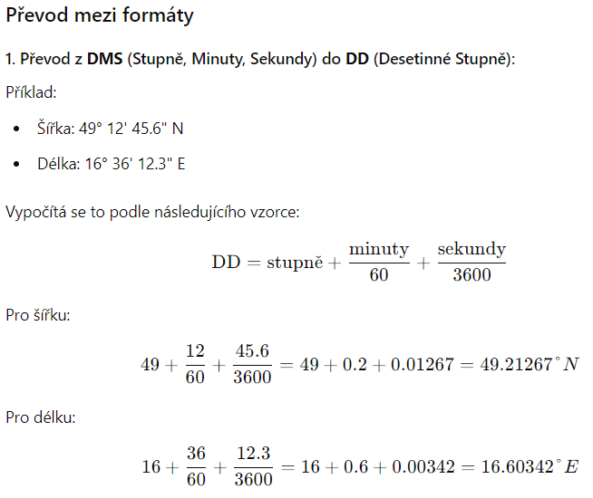

# BPALP CV02 – Převody času a GPS formátů

V tomto cvičení si procvičíte práci s proměnnými, uživatelským vstupem a převody mezi různými formáty.

---

## Předpoklady - práce na vlastním zařízení

_Školní zařízení již všechen potřebný software obsahují._

Pokud chcete pracovat na vlastním zařízení, postupujte podle [návodu](https://github.com/ondyChrbi/kst-bpalp-assignments-2026/blob/main/tutorials/instalace-software.md) k instalaci potřebného softwaru v souboru.

---

## Úkol 02A: Převod času

- Založte nový projekt v Javě ve vývojovém prostředí NetBeans nebo jiném dle vašeho výběru.
- Vytvořte program, který:
    - Načte uživatelský vstup představující čas v sekundách.
    - Převede zadaný čas na počet **dnů, hodin, minut a sekund**.
    - Vypište výsledek do konzole.

- Nevalidní vstupy ignorujte.

---

## Úkol 02B: Převod GPS souřadnic 

- Vytvořte program, který provede převod GPS souřadnic:
    - Načtěte uživatelský vstup v **DMS** formátu (stupně, minuty, vteřiny).
        - Např. `50°5'15" N, 14°25'14" E`
        - Zamyslete se kolik uživatelských vstupů a proměnných budete potřebovat.
        - Dejte si obzvlášť pozor na datový typ daných proměnných.
    - DMS formát převeďte do DD formátu pro šířku a délku.
    - Vypište výsledek do konzole.

- Nevalidní vstupy ignorujte.



---

## Studijní prompt

Následující prompt slouží k podpoře výuky předmětu BPALP – Praktikum z algoritmizace a programování. Zadání promptu vložte do jednoho z Vámi preferovaných AI nástrojů:

```llm-ai-prompt
Jsem studentem 1. ročníku oboru Informační technologie na Fakultě elektrotechniky a informatiky Univerzity Pardubice. Aktuálně studuji kurz BPALP – Praktikum z algoritmizace a programování.

Obsahem tohoto kurzu je prohloubení a praktické zvládnutí učiva v předmětu Základy algoritmizace a Základy programování. Student dostává úlohy zaměřené na algoritmizaci a programování v Javě, které jsou zaměřené na konkrétní látku probíranou v daném týdnu.

Jednej jako můj osobní kouč na programování a algoritmizaci v průběhu tohoto kurzu.

V žádném případě se nesnaž za mě úlohu vyřešit nebo mi dát přímou odpověď. Tvým úkolem je:
- Pomoci mi pochopit danou látku do hloubky.
- Vysvětlit mi jednotlivé části kódu ve srozumitelné češtině.
- Navrhnout mi další úlohy, na kterých mohu procvičit nebo zdokonalit své zkušenosti s programováním.

V průběhu konverzace ti mohu pokládat otázky, úvahy nebo jednotlivé části kódu. Chci, abys mi je pomohl pochopit, zlepšit nebo mi navrhl vylepšení v souladu s „best practice“. Pokud v kódu uvidíš chybu, zkus mě na ni navést a dát mi nápovědy.

Aktuálně se nacházíme v 2. týdnu semestru.

Dosavadní znalosti z předchozích týdnů:
- Základní aritmetické operace, celá a desetinná čísla, výpis do konzole, proměnné.

Téma dnešního cvičení:
- Opakování učiva z minulého cvičení, uživatelský vstup, konstanty, desetinná čísla

Další informace:
- Programovací jazyk: Java
- Vývojové prostředí: Apache NetBeans
- Prozatím nepoužívej OOP, vícevláknové programování nebo funkcionality z Javy 25 nebo novější.

Pro začátek mi navrhni, jak mi můžeš pomoci se zvládnutím tohoto úkolu. Pro první odpověď mi vytvoř interaktivní menu podobného formátu:

-----------------------------------------
1. 📕 Vysvětlit danou látku
2. 🧩 Navrhnout úlohu na procvičení
3. 🔎 Projít můj kód
4. [Další možnost, kterou uznáš za vhodnou]
5. [Další možnost, kterou uznáš za vhodnou]
6.❓ Cokoliv jiného, s čím ti můžu pomoci?
-----------------------------------------
```

*Jako základ pro tvorbu studijního promptu byl využit prompt z videa [Learning to code has changed - Traversy Media](https://www.youtube.com/watch?v=gQnBetuyktk).*